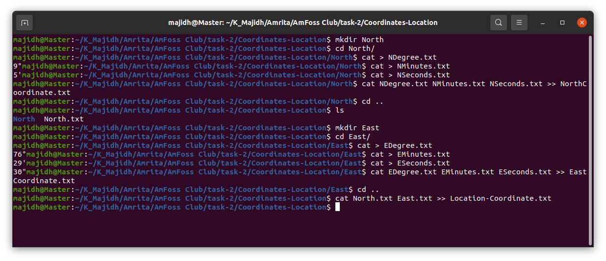

# COMMANDS USED IN TERMINAL
```
$ mkdir North (for creating a North directory)
$ cd North/ (to move into North directory)
$ cat > NDegree.txt (To store the value of degree)
$ cat > NMinutes.txt (To store the value of minute)
$ cat > NSeconds.txt (To store the value of second)
$ cat NDegree.txt NMinutes.txt NSeconds.txt >> NorthCoordinate.txt (for combining all three files data in one file)
$ cd .. (for going back)
$ ls (to see the files )
$ mkdir East (for creating a East directory)
$ cd East/ (to move into North directory)
$ cat > EDegree.txt (To store the value of degree)
$ cat > ESeconds.txt (To store the value of second)
$ cat > EMinutes.txt (To store the value of minute)
$ cat EDegree.txt EMinutes.txt ESeconds.txt >> EastCoordinate.txt (for combining all three files data in one file)
$ cd ..(for going back)
$ cat North.txt East.txt >> Location-Coordinate.txt (for combining two files data in one file)
```

# SCREENSHOTS



# COMANDS USED TO PUSH COMMITS TO GITHUB REPO.
```

```